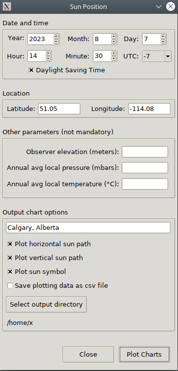
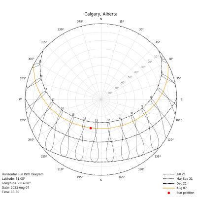
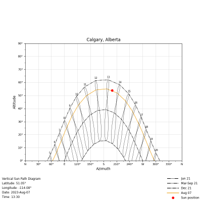

Sun Position v1.0.0
===================

**Sun Position** is a Python application that outputs the horizontal and vertical sun-path diagrams as png files. The input parameters are completed using a GUI built with Python's tkinter. The algorithms and formulas used to calculate the sun position were taken from the paper *'Solar position algorithm for solar radiation applications'
(I. Reda, A. Andreas, 2003)*

Installation
------------
Only one dependency is requiered: the matplotlib library.
To install the application use:

```
pip install sun-position
```

Usage
-----
The application uses a GUI that should facilitate the input of parameters. Note that there is input validation but it is not exhaustive. Some details:
* The minimum year is 1900 and the maximum is 2100
* Latitude and longitude ranges are -90 to 90 and -180 to 180
* The elevation, atmospheric pressure and temperature values are optional
* The plotting data is saved as a csv file with the fields: **dates**, **azimuths** and **altitudes**.  There are 365/366 records (one for each day) and the azimuths and altitudes contain 24 values each (for every hour of the day). The csv file is named as *SunPositions_year-month-day.csv*
* The png files are automatically named as *VerticalSunPath_year-month-day.png* and *HorizontalSunPath_year-month-day.png* where year-month-day are the dates for which the sun-path is calculated
* The resolution of the output images is 800x800 pixels, enough for most reports or presentations. Nonetheless, other resolutions can be specified in the config.py file
* The output png files and the plotting data (if the option is selected) will be stored in the selected output directory

Sun position screenshots
---------------------------
**The graphical use interface**



**An expample of an horizontal sun-path diagram**



**An example of a vertical sun-path diagram**




