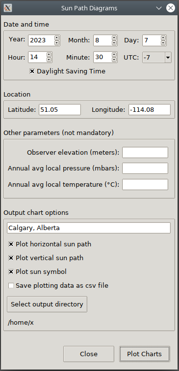

Sun Position v1.0.0
===================

**Sun Position** is a pure Python application that outputs, as png images, the horizontal and vertical sun-path diagrams. The input parameters are completed using a GUI built with Tkinter. The algorithms and formulas used to calculate the sun position were taken from the paper *'Solar position algorithm for solar radiation applications'
(I. Reda, A. Andreas, 2003)*.

Installation
------------
Only one dependency is required: the matplotlib library. To install the application use:

```
pip install sun-position
```

Usage
-----
The input parameters in the GUI should be self-explanatory. Note that there is input validation built in the GUI but it is not exhaustive. Some extra information:

* The minimum year is 1900 and the maximum is 2100
* Latitude and longitude ranges are -90 to 90 and -180 to 180
* The elevation, atmospheric pressure and temperature values are optional
* The image files are automatically named as *VerticalSunPath_year-month-day.png* and *HorizontalSunPath_year-month-day.png* where year-month-day is the date for which the sun-path is calculated
* The resolution of the output images is 800x800 pixels, enough for most reports or presentations. Nonetheless, and if required other resolutions can be specified in the config.py file
* The plotting data is saved (if selected) as a .csv file with the fields: **dates**, **azimuths** and **altitudes**.  There are 365/366 records (one for each day of the year) and the azimuths and altitudes contain 24 values each (for every hour of the day). The .csv file is named *SunPositions_year-month-day.csv*

Sun position screenshots
---------------------------
**The graphical use interface:**



**An expample of an horizontal sun-path diagram:**


**An example of a vertical sun-path diagram:**


